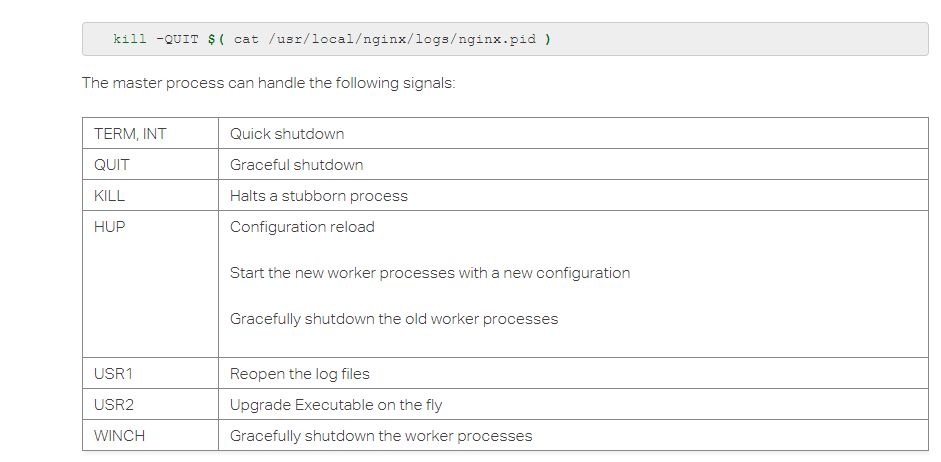
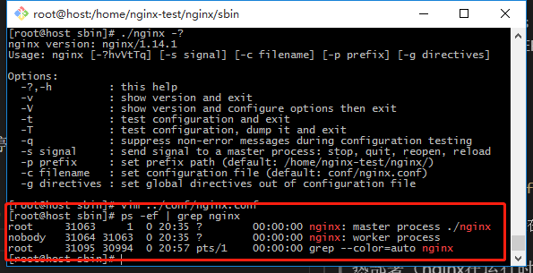
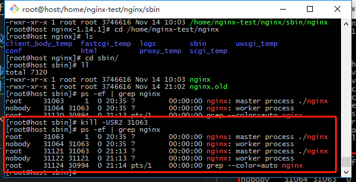
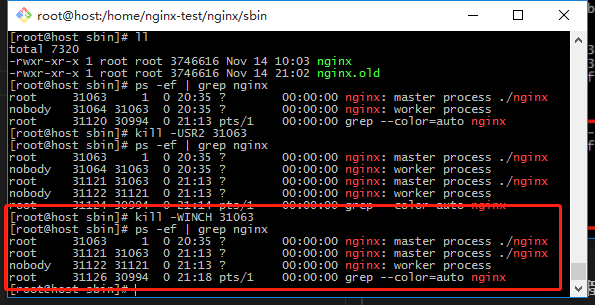
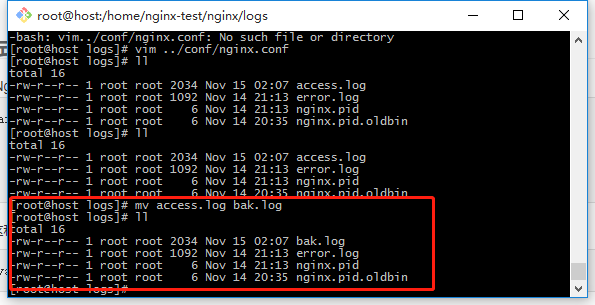
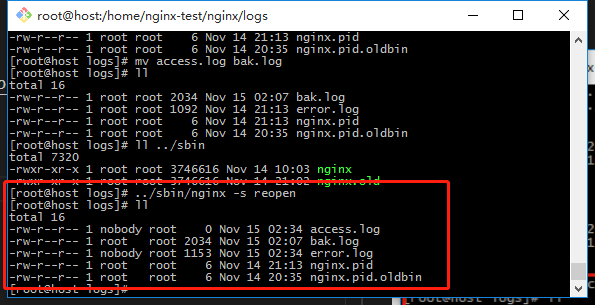

# Nginx命令行及演示：重载、热部署、日志切割

> 参考：https://www.nginx.com/resources/wiki/start/topics/tutorials/commandline/

> 命令行：
- 06.发送信号：
    - （1）nginx -s reload|stop|quit|reopen...
    - （2）kill -USR1|... process_id

    

## 命令行演示

### 重载配置文件

`vim ../conf/nginx.conf`

`nginx -s reload`（nginx在不停止对客户服务的情况下使用了新的配置项）

### 热部署（nginx在运行时升级）

#### 1)查看nginx进程
`ps -ef | grep nginx`



#### 2）备份原来的nginx二进制文件
`cp nginx nginx.old`
#### 3) 将新编译出的nginx二进制文件复制并替换当前正在运行的nginx二进制文件（更换二进制文件）

`cp -r objs/nginx /home/nginx-test/nginx/sbin/nginx -f`

#### 4)给nginx主进程发送信号告知要热部署，做一次版本升级

`kill -USR2 31063`



> 

#### 5)优雅关闭老的worker进程

`kill -WINCH 31063`



> 老的master进程还在，但它的worker进程已经没有了（所有的请求都已经转移到新nginx下的worker进程下了，但我们有可能需要退回到老版本）

> 退回到老版本：我们还可以给老的nginx的master进程（31063）发送reload命令，让其重新启动worker进程，后面再把新版本关掉。（老的master进程是不会自动退出的，留下来允许我们做回退）

### 切割日志文件

#### a.手动分割：

##### 1）copy一份要切割（备份）的log

`mv access.log bak.log`



##### 2）reopen重新生成日志文件

`../sbin/nginx -s reopen`



#### b.用crontab和.sh脚本定时自动分割

##### 1）crontab：

```
0 0 1 * * root /usr/local/openresty/nginx/logs/rotate.sh
...
```

##### 2）rotate.sh

```sh
#!/bin/bash
#Rotate the Nginx logs to prevent a single logfile from  consuming too much disk space.
LOGS_PATH=/usr/local/openresty/nginx/logs/history
CUR_LOGS_PATH=/usr/local/openresty/nginx/logs
YESTERDAY=$(date -d "yesterday" +%Y-%m-%d)
mv ${CUR_LOGS_PATH}/taohui_access.log ${LOGS_PATH}/taohui_access_${YESTERDAY}.log
mv ${CUR_LOGS_PATH}/maomaoxiong_access.log ${LOGS_PATH}/maomaoxiong_access_${YESTERDAY}.log
mv ${CUR_LOGS_PATH}/error.log ${LOGS_PATH}/error_${YESTERDAY}.log
## 向 Nginx 主进程发送 USR1 信号。USR1 信号是重新打开日制文件
kill -USR1 $(cat /usr/local/openresty/nginx/logs/nginx.pid)
```