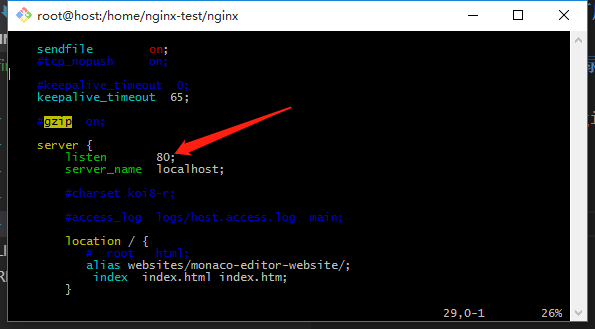
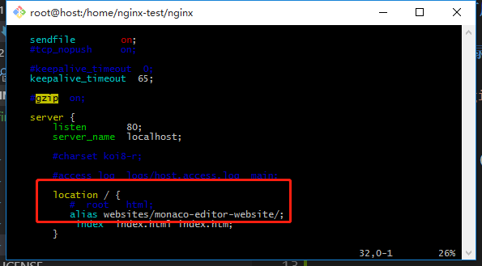
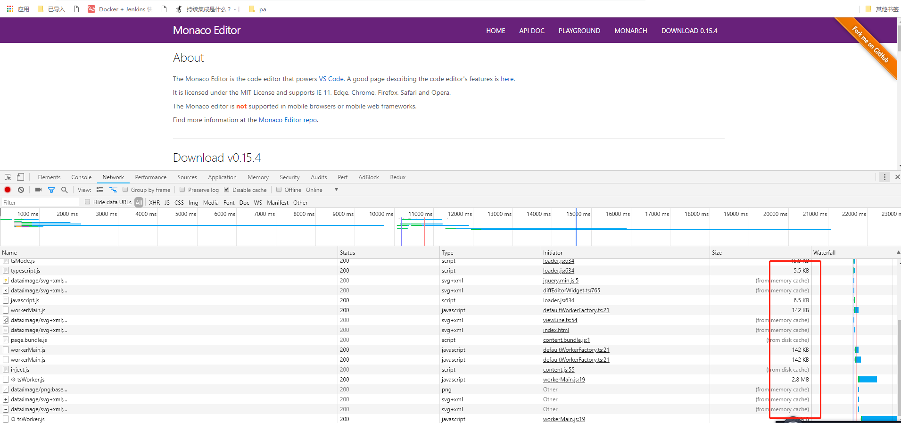
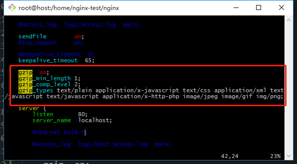
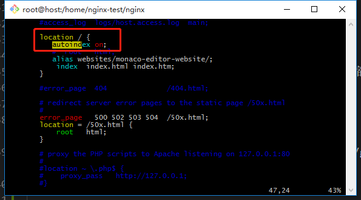
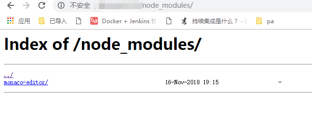

# 用Nginx搭建一个可用的静态资源Web服务器

## 配置nginx工作目录

> nginx文档：http://nginx.org/en/docs/

> 配置文件目录: `nginx/conf/nginx.conf`

> 配置完成重启nginx：`nginx -s reload`

### 配置监听端口


### 配置location

`nginx/websites/`

- `location /`表示匹配所有请求
- 指定URL后缀与文件目录后面的后缀一一对应：
    - （1）`root`：（root会把url中的一些路径带到文件目录中来？）
    - （2）`alias`：（一般使用这个）



nginx效果：


> 传输的文件未压缩

### 打开gzip压缩

```nginx
http {
    ...

    gzip  on;  # 打开gzip压缩
    gzip_min_length 1;  # 小于1字节的文件就不再进行压缩
    gzip_comp_level 2;  # 压缩等级 
    # 针对。。。类型的文件进行压缩
    gzip_types text/plain application/x-javascript text/css application/xml text
/javascript application/x-http-php image/jpeg image/gif img/png;

    ...
}
```



### 显示目录，autoindex



web效果：


### 限制访问速度（公网带宽有限，当有许多并发用户访问服务会形成争抢关系，限制访问某些大文件的速度，以期望空出带宽来访问必要的小文件,如css、js等）

`set $limit_rate 1k`

### 记录access日志

``` nginx
http {
    ...

    # 日志格式
    log_format main '$remote_addr - $remote_user [$time_local] "$request" '
                    '$status $body_bytes_sent "$http_referer" '
                    '"$http_user_agent" "$http_x_forwarded_for"';

    ...

    server {
        ...

        # 日志所在文件
        access_log logs/geek.access.log main;

        ...
    }
}

```

> log_format参考：http://nginx.org/en/docs/http/ngx_http_log_module.html#log_format

> access_log参考：http://nginx.org/en/docs/http/ngx_http_log_module.html#access_log