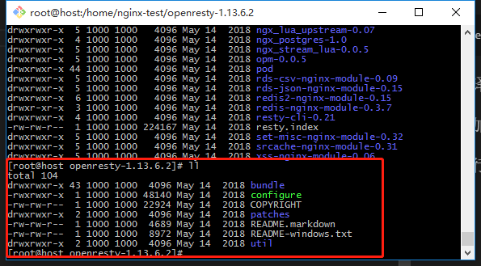
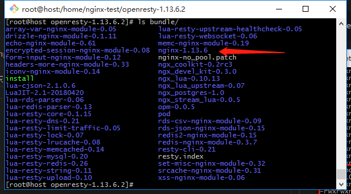
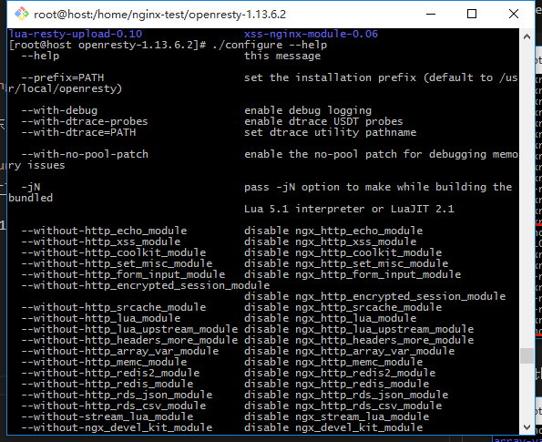
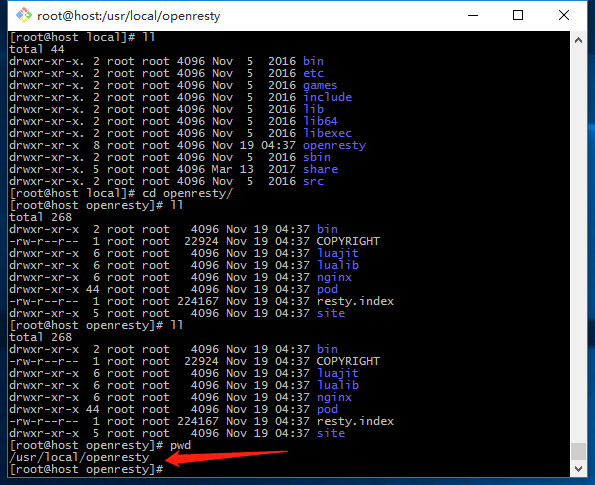
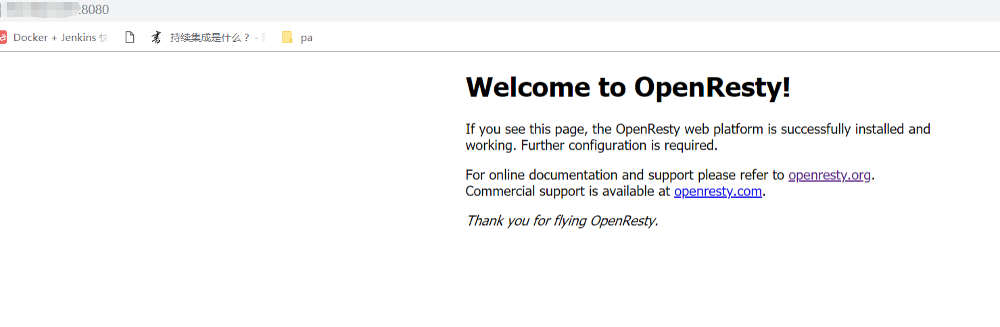
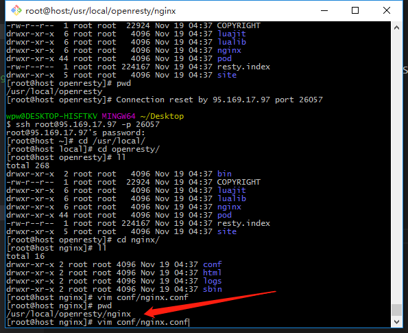
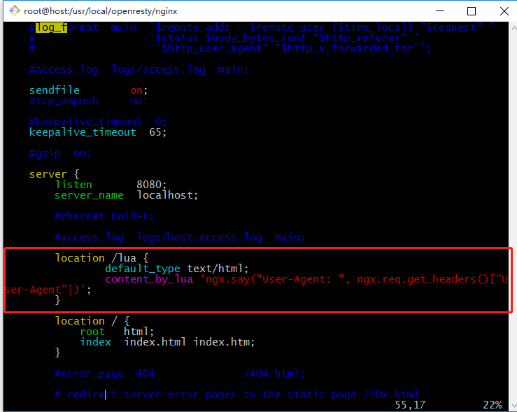
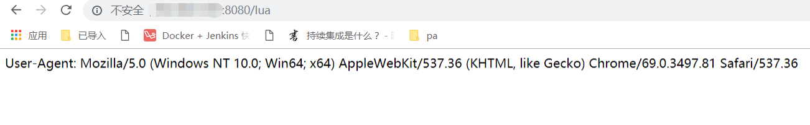

# OpenResty安装实践

## 01 下载OpenResty

```bash
$ wget https://openresty.org/download/openresty-1.13.6.2.tar.gz
$ tar -xzf openresty-1.13.6.2.tar.gz
```

## 02 分析目录结构

```bash
cd openresty-1.13.6.2
```



- 相比nginx源码目录，少的东西在`bundle`中



当前openresty基于nginx-1.13.6

- configure

```bash
$ ./configure --help
```




## 03 编译

- 编译最基本的openresty：`./configure`

> ./configure: error: SSL modules require the OpenSSL library.
> 解决：`yum install -y openssl openssl-devel`

- 编译安装
```bash
$ make
$ make install
```

> openresty所在路径：`/usr/local/openresty`



> 运行openresty：编辑openresty中nginx的配置文件改端口，再启动改nginx
```bash
$ vim nginx/conf/nginx.conf # 将端口改为8080
...
$ ./nginx/sbin/nginx # 运行openresty的nginx
```



## 04 添加Lua代码



```nginx
...
http {
    ...
    server{
        ...
        location /lua {
            default_type text/html;
            content_by_lua 'ngx.say("User-Agent: ", ngx.req.get_headers()["User-Agent"])';
        }
        ...
    }
    ...
}
```



## 05 运行

- 重启nginx：`./sbin/nginx -s reload`

- 访问`/lua`:

