# 编译Nginx

- （1）下载Nginx
- （2）介绍各目录
- （3）Configure
- （4）中间文件介绍
- （5）编译
- （6）安装

## 过程

### 1.打开nignx官网：`nginx.org`
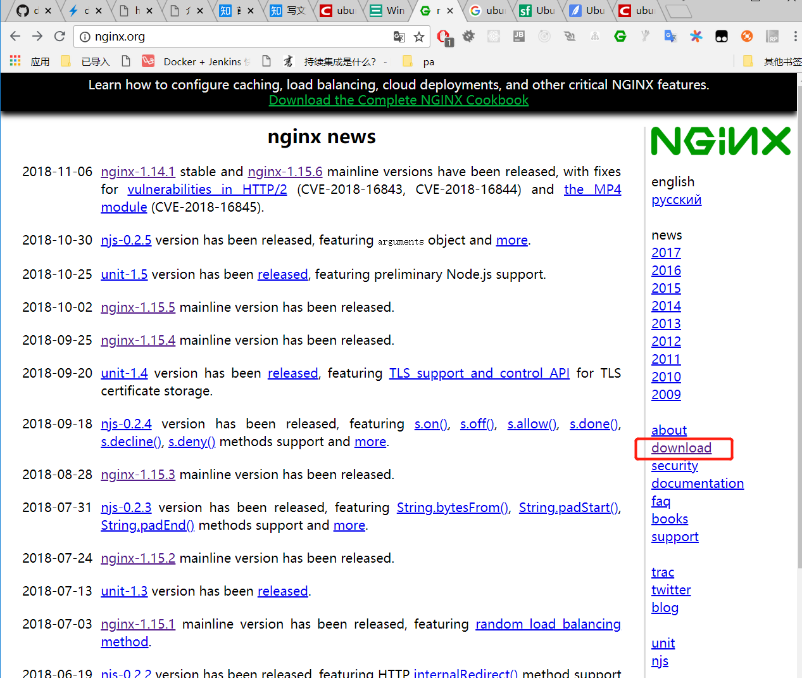
### 2.点击右侧`download`
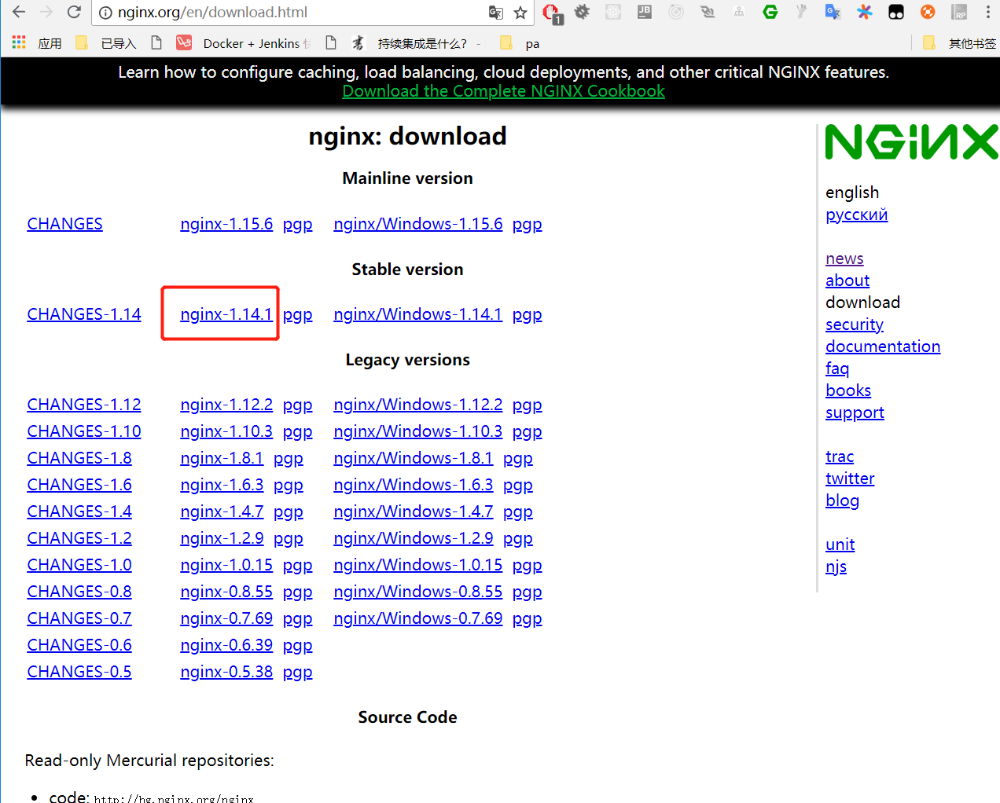
### 3.下载源码
- 右键点击上图红圈中的`nginx-1.14.1`,选中**复制链接地址**
- 打开centos的bash，输入
```bash
wget http://nginx.org/download/nginx-1.14.1.tar.gz
```
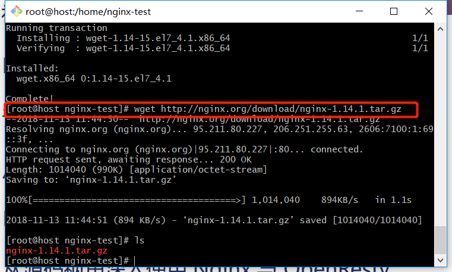

- 解压
```bash
tar -xzf nginx nginx-1.14.1.tar.gz  
```
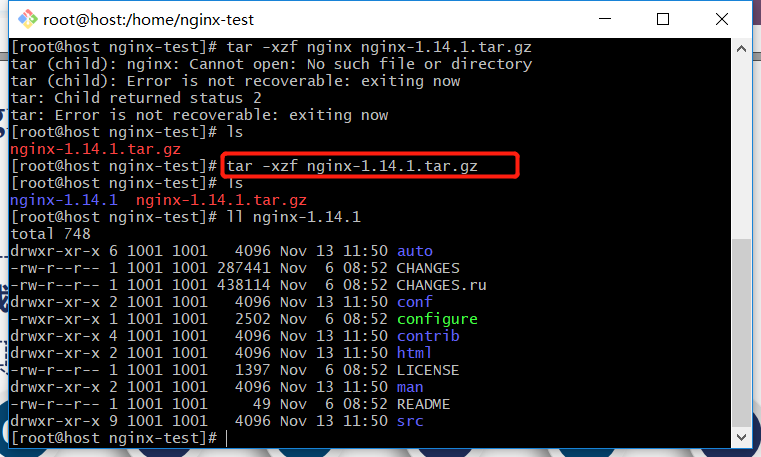

> [nginx源码目录](./8-nginx-source-file.md/#Nginx源码目录)

- 编译
    - 编译前看看configure支持哪些参数（`./configure --help`）
        - 第一类：nginx执行中会去找哪些目录中下的文件作为它的辅助文件
        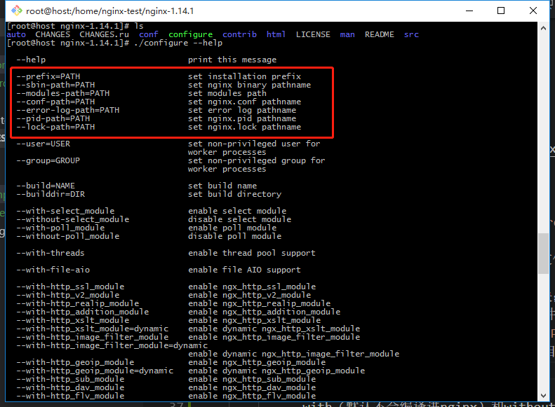
            - `--modules-path=PATH`：使用动态模块；`--lock-path=PATH`:确定nginx.lock文件在的路径；没有任何变动，只需要指定`--prefix=PATH`(所有其他的这类文件会在prefix目录下建相应的文件夹)
        - 第二类：
        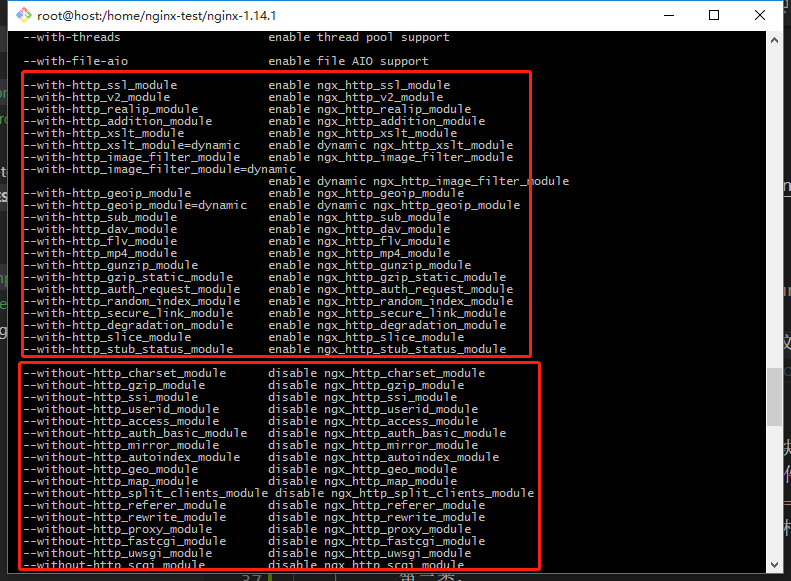
            - with（默认不会编译进nginx）和without（默认编译进nginx）
        - 第三类：指定了nginx编译中需要的一些特殊参数
        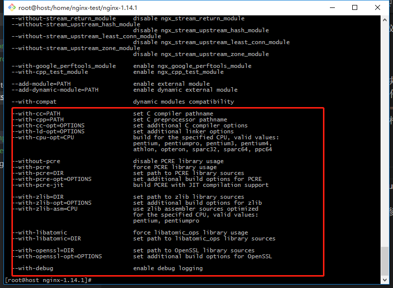
    
    - 实际编译nginx：
        - 1.用默认参数
        `./configure --prefix=/home/nginx-test/nginx`
            > error:

            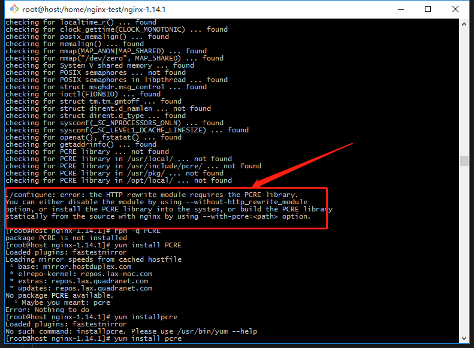

            - #### 解决：`yum install pcre`,再configure，出错：

            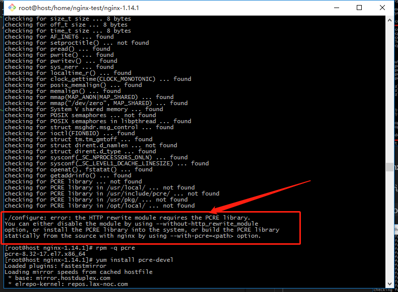

            - #### 解决：`yum install pcre-devel`,再configure，出错：

            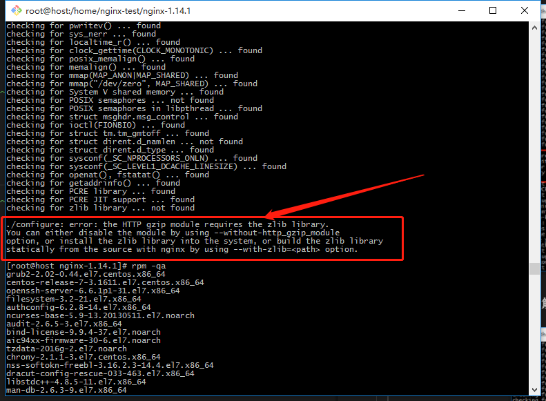

            - #### 解决：`yum install -y zlib-devel`,再configure,OK！

            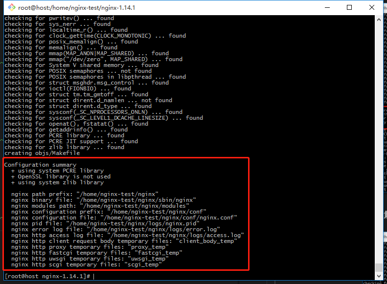

            > configure生成的中间文件在`nginx-1.14.1/objs`中

            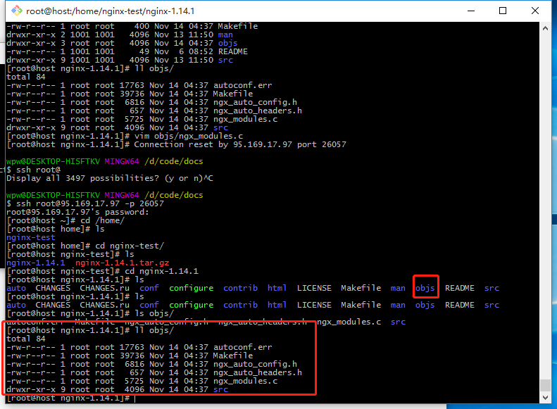

                - objs中ngx_modules.c：有哪些模块会编译进nginx
            
            - #### make 编译：nginx-1.14.1/下运行`make`
            > make产生的文件（中间文件、二进制文件、可执行文件，目标文件nginx。。）在objs中

            > 了解上述知识点的原因：nginx版本升级，不能直接执行make install,而要执行make然后将产生的目标文件nginx拷贝到安装目录中

            > c语言生成的所有中间文件都会放在objs/src/目录中

            > 若使用了动态模块，同样也会生成.so文件在objs目录中

            - 执行`make install`**首次**安装时可以使用这个命令

            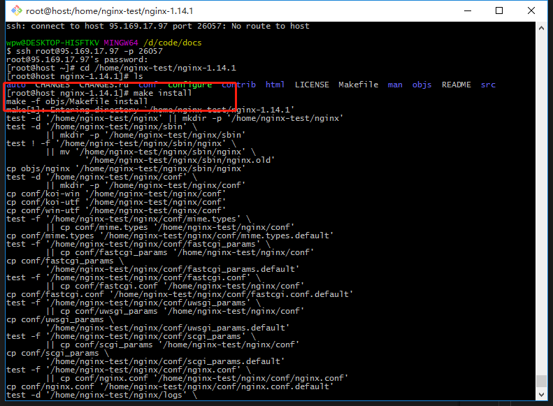

            > 安装完成后，进入nginx目录：`cd /home/nginx-test/nginx`

            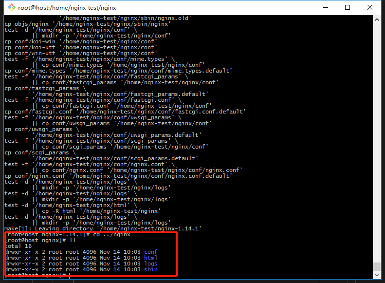

                - 其中，sbin/（nginx二进制文件）、conf/（决定nginx配置功能的文件）、logs/（access log和error.log）