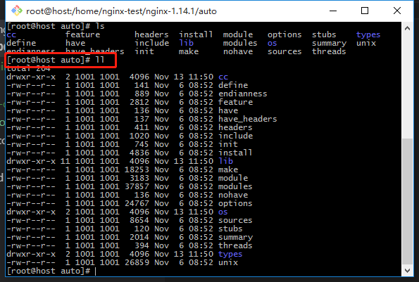
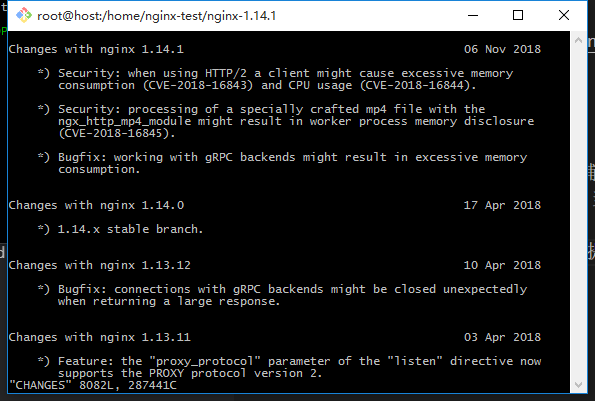
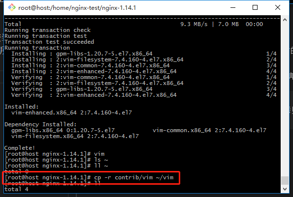
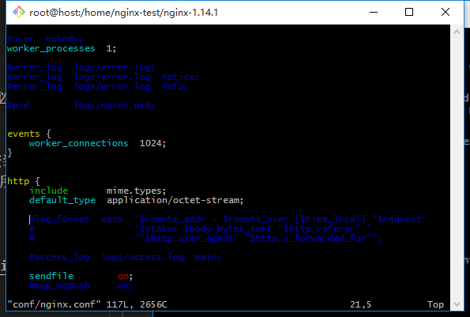

# Nginx源码目录


- `auto`目录：

    > 4个子目录
    - `cc`用于编译
    - `lib`
    - `os`对操作系统判断
    - 其他所有文件都是为了辅助configure脚本执行时去判定我们的nginx支持哪些模块、当前的操作系统有什么样的特性可以供nginx使用
- changes文件：nginx版本中提供的特性和Bugfix
```
vi CHANGES
```

    - feature、bugfix、changes

- `conf`文件夹：示例文件，配置示例文件
- configure脚本：用来生成中间文件，执行编译前的一个必备动作
- `contrib`文件夹：提供了两个perl脚本和vim工具
    - 没有使用vim工具，打开nginx.config无高亮
        > centos自带的vi（打开虽然会显示vim），要安装vim（`yum install vim`）,然后将contrib/vim中所有文件拷贝到当前用户目录中（`cp -r contrib/vim ~/vim`）

        
        - 再次打开nginx.config（`vim conf/nginx.config`）,语法高亮

        
- `html`文件夹：50x.html（50x错误重定向界面），index.html默认欢迎页面
- `man`文件夹：linux对nginx帮助文件（打开：`man man/nginx.8`）
- `src`文件夹：nginx源代码